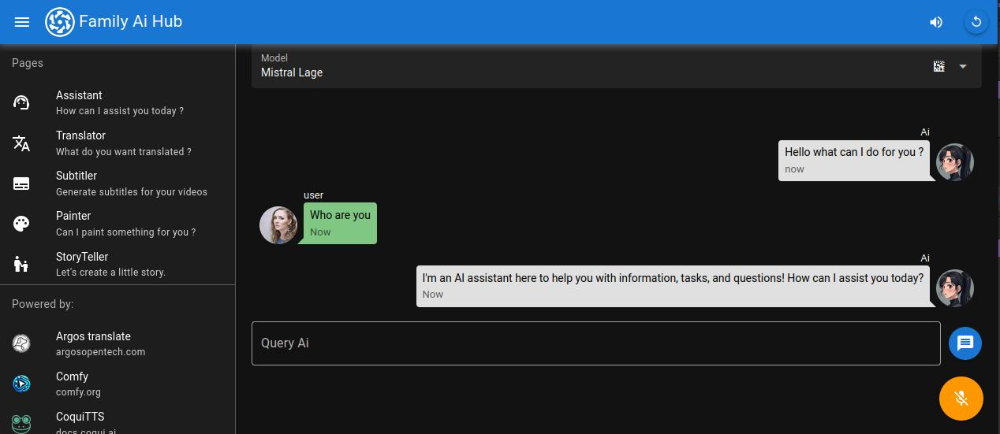
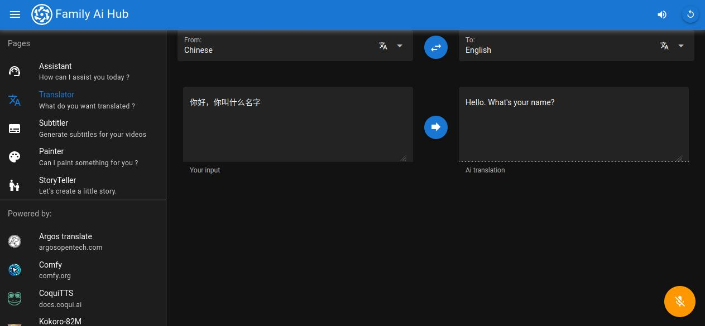
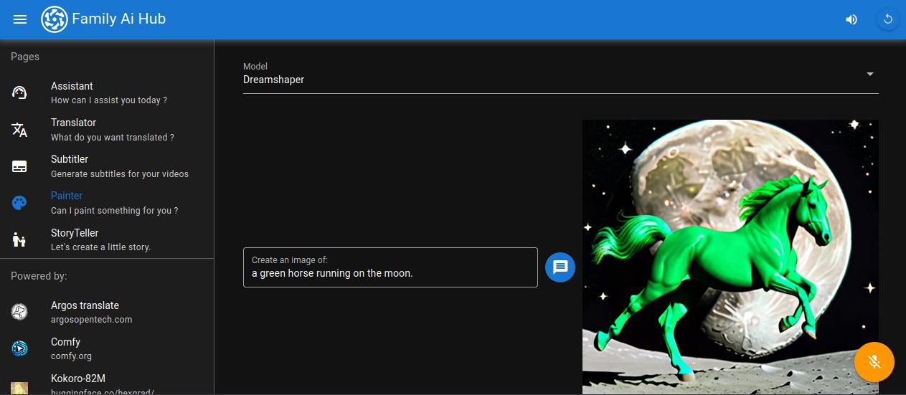
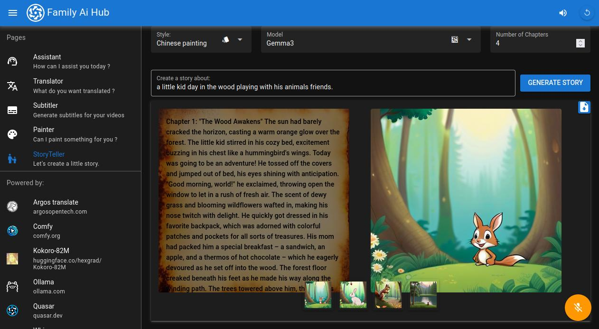
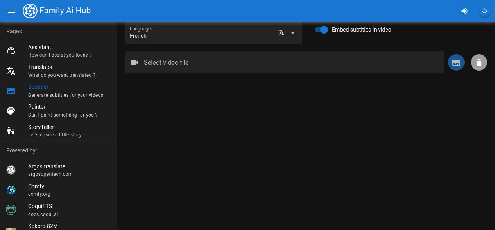

# Family AI
An open source, self hosted, mobile friendly web app proposing multiple ai services enhanced with a text to speech and speech to text interface.
The application is plugged to various "Ai" APIs to provide the following local hosted services:
* Chat discussion 
  
* Translation
  
* Image generation
  
* Kid story creation
  
* Subtitles generation (and translation)
  

A CUDA enabled GPU is necessary to be able to perform the different API generations.

## tldr:
setup secrets in `secrets` folder
```shell
cp .env.tpl .env
docker compose up
```
open [http://localhost:9000](http://localhost:9000)

## App:
The personal assistant web app. built using Quasar.

### Application build:
To build the app for proper serving:
```bash
docker compose exec -it app quasar build
```

## APIs
see different APIs documentations are available on their own ports:
* LLM API `http://localhost:8185/docs#`
* translation API `http://localhost:8187/docs#`
* Text to Speech / Speech to Text API `http://localhost:8186/docs#`
* ComfyUI `http://localhost:8188`

### Translation:
a neural translation service cf [ArgosOpenTech](https://www.argosopentech.com/)

### Comfy
A GenAi tool to generate pictures but not only. cf [comfy.org](https://docs.comfy.org)

#### Setup:
two text to 2D workflows are currently supported:  
* Stable Diffusion XL download the models you want into comfy/models/checkpoints
* Z image see [ComfyUI setup](https://docs.comfy.org/tutorials/image/z-image/z-image-turbo)

### LLM:

A LLM Ai assistant using various models locally and cloud based. It is based on [Ollama](https://ollama.com/) and [LangChain](https://www.langchain.com/)

#### Models download:
you can download additional [supported models](https://ollama.com/library) in the ollama container directly:
```bash
docker compose exec -it ollama ollama run {model_name}
```

### TTS:
A text to speech utility using [kokoro-82M](https://huggingface.co/hexgrad/Kokoro-82M)  
A speech to text utility using [whisper](https://github.com/openai/whisper)  

## Build base image:
Base image building:
```bash
docker build . -f Dockerfile -t lerignoux/base-ai-service
```

### Pypi custom mirror
If you need to use a custom mirror:
```bash
docker build . -f Dockerfile --build-arg UV_DEFAULT_INDEX=https://pypi.tuna.tsinghua.edu.cn/simple  -t lerignoux/base-ai-service
```

## Deployment
To deploy the app on your own host,
* update the `HOST` variable in `.env`.
* in the server start the apis: `docker compose up`
* update `app/family-ai/.env` file using the `family-ai/.env.prod` template, updating the relevant `<YourHost>`
* Build the App cf `App`
* Serve it using the example nginx template; `nginx/config.json`:
 mount the `app/family/ai-dist/spa` into your webserver, ex `/etc/nginx/html/family-ai/dist/spa`

## Multi-GPU
if you have multiple GPUs you can spread the load over them overriding the GPU id's
see `docker-compose.override.tpl.yml` for example:
```
cp docker-compose.override.tpl.yml docker-compose.override.yml
```

## Contributions:
* Contributions and bugs are welcome, please follow the standard open source procedure.

## License:
* Different services and code parts have their own licenses.
* The rest of the code follows a GPL v3 license. cf `./License.md`
